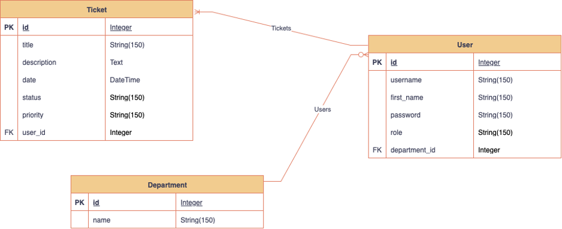

# Helpdesk Web Application - README

## Application Summary
The Helpdesk application is a Flask-based web application that serves as a simple and efficient way to manage support tickets within PA Consulting. It leverages Python 3.13.5, Flask, Flask-Login, Flask-SQLAlchemy and Werkzeug for password hashing. The frontend utilises Bootstrap for styling and JavaScript for user interaction. Backend testing was conducted using Pytest, while the frontend was tested using Jest.

## Deployed Application

You can access the live Helpdesk Web Application here: https://thehelpdeskapp.onrender.com

### Technical Architecture
- **Backend**: Python Flask framework with SQLAlchemy for database operations
- **Database**: SQLite with 3 tables (User, Ticket, Department)
- **Frontend**: HTML with Jinja2, Bootstrap and JavaScript
- **Authentication**: Flask-Login for session management and user authentication


### Design
The application follows MVC architecture:
- **Models** (`models.py`): Database schema and relationships
- **Views** (`views.py`, `auth.py`): Handles routes and validation logic  
- **Templates**: HTML pages with Jinja2 templating
- **Static Assets**: JavaScript and styling components

### Entity Relationship Diagram



## Setup Instructions
1. Download the Zip File and open in your chosen IDE

2. **Create and activate a virtual environment.**
   Run the following commands in the terminal:

   - **For macOS/Linux:**
     ```sh
     python3 -m venv venv
     source venv/bin/activate
     ```

   - **For Windows:**
     ```sh
     python -m venv venv
     venv\Scripts\activate
     ```


3. **Install dependencies:**
   ```sh
   pip install -r requirements.txt
   ```
4. **Run the application:**
   ```sh
   python3 main.py
   ```
5. **The database should seed automatically.**
If not, run the following command in the terminal:
   ```sh
   python3 seed_db.py
   ```
7. **Access the app:**
   Open your browser and go to [http://localhost:5000](http://localhost:5000)


## JavaScript Testing (Frontend)

To run tests for the JavaScript file `index.test.js` in `helpdeskapp/static/`, follow these steps:

1. Open a terminal and navigate to the static directory:
   ```sh
   cd helpdeskapp/static
   ```
2. Install Node.js dependencies (only needed once):
   ```sh
   npm install
   ```
3. Run the tests:
   ```sh
   npm test
   ```

## Python Testing (Backend)

To run all Python tests, use the following instructions:

1. Open terminal and navigate to the project root directory `thehelpdeskapp/`.
2. Make sure your virtual environment is activated and dependencies are installed.
3. Run all tests with pytest:
   ```sh
   pytest helpdeskapp
   ```

This will run all test files in the `helpdeskapp/` directory that start with `test_`.
